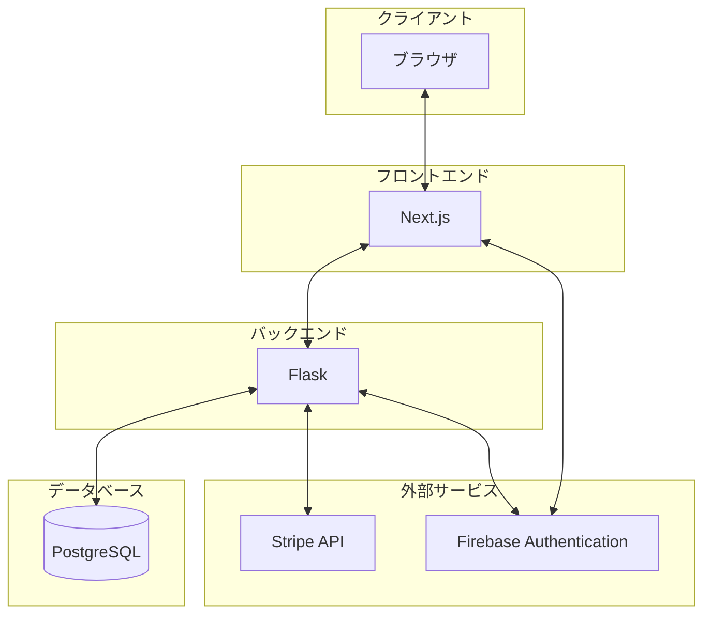

# アーキテクチャ図

このアーキテクチャでは、以下のような認証フローが想定されます。

1. ユーザーがブラウザからアプリケーションにアクセスします。
2. 認証が必要な操作を行う際、フロントエンド（Next.js）がFirebase Authenticationと直接やり取りして認証を行います。
3. 認証後、必要に応じてバックエンド（Flask）がFirebase Authenticationと通信して、トークンの検証や追加の認可処理を行います。
4. 認証済みのユーザー情報や関連データは、必要に応じてPostgreSQLデータベースに保存されます。

この構成により、セキュアで拡張性の高い認証システムを実現しつつ、
Firebaseの提供する様々な認証方法（メール/パスワード、ソーシャルログインなど）を簡単に利用することができます。
