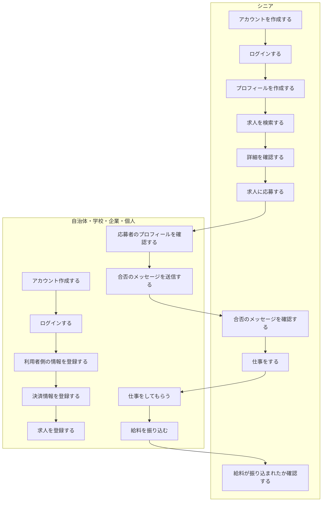

#  ユースケース図
#### シニアが求人に応募する

```mermaid

graph TD
    subgraph "シニア"
        A1["アカウントを作成する"]
        A2["ログインする"]
        A3["プロフィールを作成する"]
        A4["求人を検索する"]
        A5["詳細を確認する"]
        A6["求人に応募する"]
        A7["合否のメッセージを確認する"]
        A8["仕事をする"]
        A9["給料が振り込まれたか確認する"]
    end

    subgraph "自治体・学校・企業・個人"
        B1["アカウント作成する"]
        B2["ログインする"]
        B3["利用者側の情報を登録する"]
        B4["決済情報を登録する"]
        B5["求人を登録する"]
        B6["応募者のプロフィールを確認する"]
        B7["合否のメッセージを送信する"]
        B8["仕事をしてもらう"]
        B9["給料を振り込む"]
    end

    A1 --> A2 --> A3 --> A4 --> A5 --> A6
    B1 --> B2 --> B3 --> B4 --> B5
    A6 --> B6 --> B7 --> A7 --> A8 --> B8 --> B9 --> A9

```